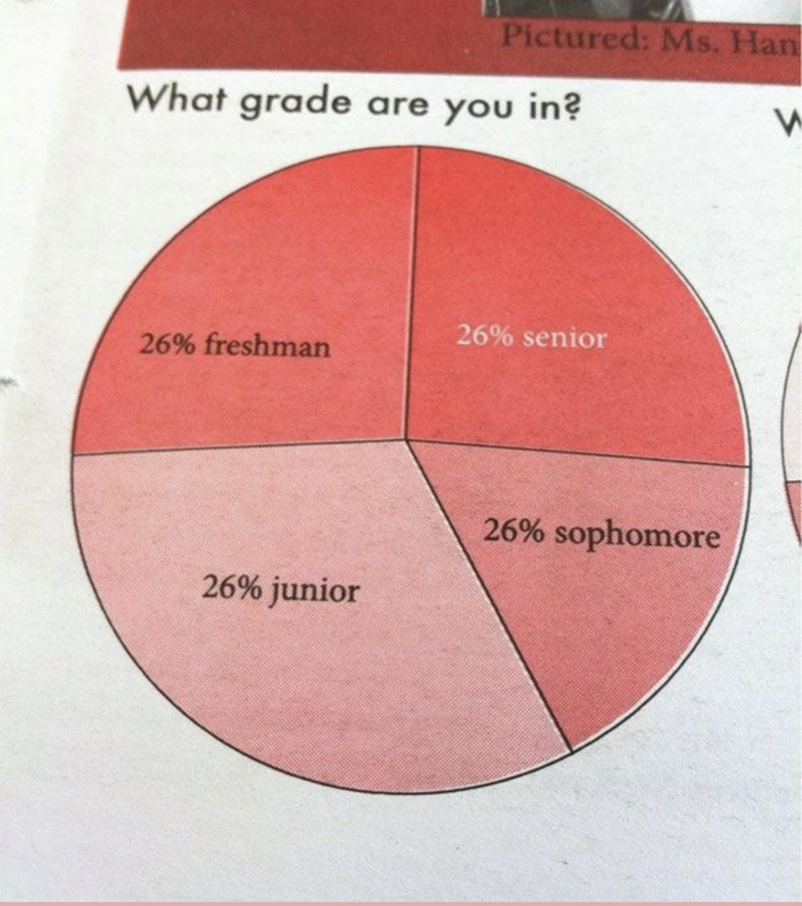
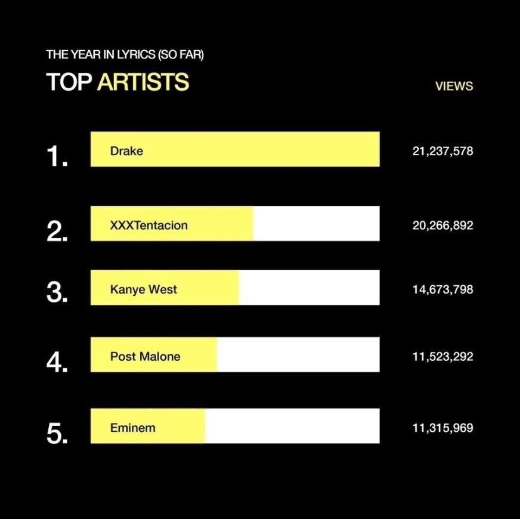
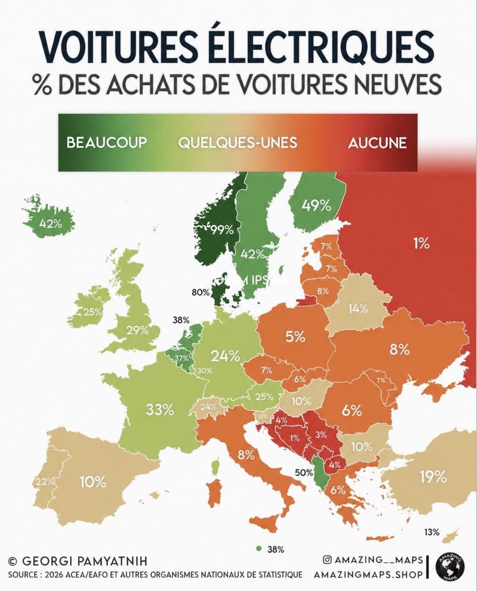

TP1 - Christella DAVID - BUT 3AFA VCOD 33

# Analyse des erreurs dans trois graphiques

## Graphique 1 : Répartition par classe (camembert)

Les quatre parts affichent chacune 26 %, ce qui fait 104 % au total, alors qu'un camembert doit toujours faire 100 %. En plus, les parts ne sont pas de la même taille à l'écran, alors qu'elles portent la même valeur : le dessin contredit les chiffres.

## Graphique 2 : Top artistes (vues)

Les barres ne sont pas proportionnelles aux chiffres. Drake (21,2 millions) et XXXTentacion (20,3 millions) sont presque à égalité, mais la barre du deuxième est deux fois plus courte. Cela donne l'impression que Drake écrase tout le monde, ce qui est faux.

## Graphique 3 : Voitures électriques en Europe (carte)

La carte mélange des choses qui ne se comparent pas : l'échelle de couleurs va de « beaucoup » à « aucune » sans donner de vrais seuils en pourcentage, et les couleurs ne suivent pas toujours les chiffres (l'Allemagne à 24 % et la Suisse à 24 % n'ont pas la même teinte). De plus, un texte parasite (« LOREM IPSUM ») recouvre le Danemark, ce qui rend la carte peu fiable.
